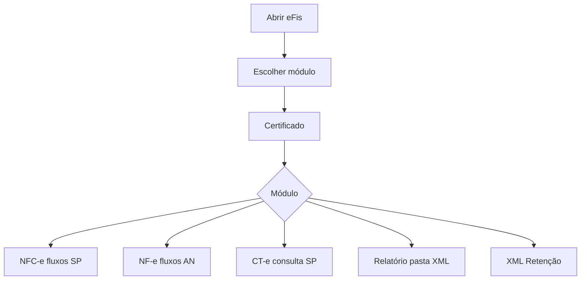

# Esquema de aprimoramento — Manual do eFis (in-app + referência)

Este documento define **estrutura**, **conteúdo obrigatório** e **nível de detalhe** para evoluir o painel **Manual** (`components/nfce/panels/manual-panel.tsx`) e, se desejado, textos espelhados no **README** / **CONTEXTO.md**. Serve como roteiro de redação; a implementação na UI pode seguir seção a seção.

---

## 1. Objetivos do aprimoramento

| Objetivo | Critério de sucesso |
|----------|---------------------|
| Transparência por módulo | Utilizador entende **o que cada módulo faz**, **quando usar** e **limites** (SEFAZ/AN) sem abrir código. |
| Certificado sem ambiguidade | Explicação clara do **modo repositório** vs **.pfx**, com destaque à opção **chave privada exportável** na instalação no Windows. |
| Coerência com o produto | Texto alinhado às abas reais (`nav-config.ts`, módulos em `AppModule`). |
| Manutenção | Secções numeradas e independentes para futuras edições (novo serviço = nova subsecção). |

---

## 2. Índice proposto do manual (árvore)

```text
Manual do eFis
├── Visão geral do aplicativo
│   ├── O que é o eFis (desktop, mTLS, sem enviar certificado à nuvem)
│   ├── Tela inicial: escolha do módulo (nenhum módulo “ativo” até clicar)
│   └── Onde pedir ajuda / logs (DEBUG=sefaz, DEBUG=cte)
│
├── Certificados digitais (capítulo central expandido)
│   ├── Papel do certificado nas operações
│   ├── Modo A — Repositório do Windows (recomendado)
│   │   ├── Requisitos (e-CNPJ A1, loja Pessoal, chave privada)
│   │   ├── Instalação / importação com chave exportável  ← detalhe pedido
│   │   ├── Conferência em certmgr.msc
│   │   └── Uso no app (lista, thumbprint, sem senha na UI)
│   ├── Modo B — Arquivo .pfx
│   │   ├── Quando usar
│   │   ├── Senha obrigatória e botão Verificar
│   │   └── Ficheiro temporário e segurança (resumo)
│   └── Problemas frequentes (TLS, certificado não exportável, CNPJ incompatível)
│
├── Módulo NFC-e (SEFAZ-SP — SAE-NFC-e)
│   ├── Finalidade e serviços (listagem, download, lote, relatório)
│   ├── Abas: Certificado, Listagem, Download XML, Relatório
│   ├── Fluxo típico (passo a passo)
│   ├── Limites e cStat (link para tabela em CONTEXTO.md / README)
│   └── Cancelar busca e confirmação ao fechar
│
├── Módulo NF-e (Ambiente Nacional)
│   ├── Finalidade (DistDFe, recepção de evento, sync NSU)
│   ├── Abas: Certificado, Distribuição DFe, Recepção evento
│   ├── Pasta, NSU, sync-debug.log, nomes de ficheiros (_procNFe, _evento, …)
│   ├── cStat 137 / 138 / 656 e timer (sem botão “limpar” manual)
│   └── CNPJ da operação = CNPJ do certificado
│
├── Módulo CT-e (SEFAZ-SP)
│   ├── Finalidade (consulta situação por chave, CTeConsultaV4)
│   ├── Abas: Certificado, Consulta XML
│   ├── tpAmb, endpoint produção vs homologação
│   └── Guardar protCTe / procCTe / SOAP bruto
│
├── Módulo Relatório
│   ├── Quando aparece (módulo dedicado no picker)
│   ├── XLSX a partir da pasta de XMLs NFC-e
│   └── Convenção de nomes dos ficheiros gerados
│
├── Módulo XML Retenção
│   ├── Objetivo (classificação por retenção)
│   └── Fluxo resumido (seleção, análise, exportação, relatório)
│
└── Observações gerais e boas práticas
    ├── Não fechar durante operações longas
    ├── Produção vs homologação (o que o app fixa em produção)
    └── Referências oficiais (portais SEFAZ / AN)
```

---

## 3. Certificados digitais — texto detalhado (base para o manual)

### 3.1 Papel do certificado

O eFis usa o certificado **ICP-Brasil (e-CNPJ)** para autenticação **mTLS** com a SEFAZ e com o Ambiente Nacional. A **chave privada** tem de estar acessível na máquina do utilizador; o aplicativo **não** envia o certificado para servidores da Globalpac nem grava a senha do `.pfx` em disco.

### 3.2 Modo A — Repositório do Windows *(recomendado)*

**O que é:** o certificado instalado na loja **Pessoal** do utilizador atual (`Certificados - Utilizador Atual\Pessoal`). O eFis lista certificados com **chave privada** e permite escolher por thumbprint.

**Por que “exportável” importa:** no modo repositório, o processo principal do Electron pode precisar de **exportar temporariamente** o certificado e a cadeia para um ficheiro `.pfx` em memória/pasta temporária para o motor TLS do Node.js efetuar a ligação HTTPS. Se a chave privada tiver sido marcada como **não exportável** na importação, essa exportação falha e as operações SOAP podem não funcionar ou o Windows pode recusar a operação.

**Na importação do certificado no Windows (assistente de importação):**

1. Ao importar um ficheiro `.pfx` ou `.p12` pelo duplo clique ou **certmgr.msc** → Pessoal → Certificados → Importar:
   - Procure um passo ou opções avançadas com texto equivalente a **“Marcar esta chave como exportável”** / **“Mark this key as exportable”** (a redação varia com a versão do Windows e do assistente).
   - **Ative essa opção** se a política da sua organização permitir, para compatibilidade com o eFis e ferramentas que precisam de montar o PFX para TLS.
2. Se o certificado vier de **token A3** ou **HSM** com política de **nunca exportar**, o modo repositório pode não ser utilizável com o fluxo atual do app; nesse caso use **modo arquivo .pfx** apenas se tiver um `.pfx` válido, ou consulte o suporte interno.

**Conferência após instalar:**

- `Win + R` → `certmgr.msc` → **Pessoal** → **Certificados**.
- Localize o e-CNPJ → duplo clique → separador **“Detalhes da chave privada”** / **“General”** conforme versão; verifique se existe chave privada associada.
- No eFis, aba **Certificado** → modo **Repositório** → confirme que o certificado aparece na lista e use **Verificar** se o fluxo o exigir.

**No app:** com repositório selecionado, **não é obrigatório** preencher senha na interface (o Windows desbloqueia a chave quando aplicável).

### 3.3 Modo B — Arquivo `.pfx`

**Quando usar:** cópia de segurança do certificado A1, ambientes sem instalação prévia na loja, ou quando o repositório não permite exportação.

**No app:** selecione o ficheiro, informe a **senha**, use **Verificar** antes de listagens ou downloads. A senha permanece em memória na sessão; **não** é guardada pelo `electron-store`.

### 3.4 Resolução de problemas ( bullets para o manual )

- **“Certificado não exportável” / falha ao conectar:** reimportar com **chave exportável** (se política permitir) ou usar `.pfx` com senha.
- **HTTP 401/403 ou erro TLS:** validade do certificado, cadeia ICP-Brasil, relógio do sistema.
- **CNPJ da chave ≠ CNPJ do certificado:** usar o certificado da empresa correta para a operação (comum em download NFC-e e consultas).

---

## 4. Esquema por módulo (conteúdo a transpor para o Manual)

Cada bloco abaixo pode virar uma **secção `<ManualSection>`** ou subsecção com título próprio.

### 4.1 NFC-e (SEFAZ-SP)

| Campo | Conteúdo sugerido |
|-------|---------------------|
| **O quê** | Escrituração e apoio à NFC-e em **produção** (SP): listagem de chaves por período, download unitário e em lote, relatório comparativo XLSX. |
| **Abas** | Certificado, Listagem, Download XML, Relatório. |
| **Fluxo** | Certificado → período na Listagem → Buscar (paginação automática) → selecionar chaves → Baixar em lote ou download único → opcional relatório XLSX. |
| **Detalhes** | NT 2026 / formato de data; cancelamento de listagem; overlay de progresso; limite de 100 dias e 2000 chaves por consulta com paginação `cStat 101`. |
| **Referência** | `CONTEXTO.md` (códigos NFC-e), portal NFC-e SP. |

### 4.2 NF-e (Ambiente Nacional)

| Campo | Conteúdo sugerido |
|-------|---------------------|
| **O quê** | Distribuição DFe (XML livre + sincronização por NSU), recepção de evento, listagem de XMLs gravados. |
| **Abas** | Certificado, Distribuição DFe, Recepção evento. |
| **Fluxo** | Pasta raiz + CNPJ (14 dígitos alinhado ao certificado) → sync ou consulta manual → ficheiros em `{pasta}/{CNPJ}/{ano}/{mes}/`. |
| **Detalhes** | `cStat` 138/137/656; timer após 656; `sync-debug.log`; sufixos `_procNFe`, `_resNFe`, `_evento` para não sobrescrever ficheiros. |
| **Recepção evento** | Colar XML do `nfeDadosMsg`; CDATA no envio; interpretação de `retEnvEvento` quando possível. |

### 4.3 CT-e (SEFAZ-SP)

| Campo | Conteúdo sugerido |
|-------|---------------------|
| **O quê** | Consulta de **situação** por chave (`consSitCTe`) no serviço **CTeConsultaV4** da SEFAZ-SP. |
| **Abas** | Certificado, Consulta XML. |
| **Fluxo** | Chave 44 dígitos → `tpAmb` coerente com o ambiente → endpoint produção ou homologação → Consultar → guardar `procCTe` / `protCTe` ou SOAP completo. |
| **Detalhes** | Certificado deve ser adequado ao papel na consulta; depuração `DEBUG=cte`. |

### 4.4 Relatório (módulo independente)

| Campo | Conteúdo sugerido |
|-------|---------------------|
| **O quê** | Geração de XLSX comparativo **a partir de uma pasta** já com XMLs de NFC-e (aprovadas / canceladas). |
| **Fluxo** | Escolher pasta → pré-visualização / contagem → Gerar XLSX. |
| **Nomes** | Padrão com razão social e CNPJ no nome do ficheiro (conforme implementação). |

### 4.5 XML Retenção

| Campo | Conteúdo sugerido |
|-------|---------------------|
| **O quê** | Classificação de XMLs (retenção / sem retenção / inválidos) e exportação organizada; relatório XLSX opcional no fluxo. |
| **Fluxo** | Selecionar ficheiros ou pasta → Analisar → rever linhas → Exportar / relatório. |

---

## 5. Mapa da implementação atual → conteúdo novo

| Origem atual (`manual-panel.tsx`) | Ação sugerida |
|-------------------------------------|----------------|
| Secção “0) Módulo NFC-e ou NF-e” | Substituir por **“Visão geral + escolha de módulo”** listando **NFC-e, NF-e, CT-e, Relatório, XML Retenção** e o fluxo “picker → sidebar”. |
| Secção “1) Configurar certificado” | Expandir para capítulo **Certificados** completo (secção 3 deste doc). |
| Secções 2–5 (só NFC-e) | Manter como **subcapítulo NFC-e**; acrescentar secções paralelas para **NF-e**, **CT-e**, **Relatório**, **XML Retenção**. |
| “Observações importantes” | Fundir com **boas práticas** + links para cStat; mencionar **não fechar** durante sync NF-e. |

**Sugestão técnica (opcional):** extrair blocos de texto para `docs/manual/` em Markdown e carregar no painel, ou manter arrays em `manual-panel.tsx` mas com uma constante por módulo (`MANUAL_NFCE`, `MANUAL_CERT`, …) para legibilidade.

---

## 6. Diagrama de leitura sugerida para o utilizador



---

## 7. Próximo passo (implementação)

1. ~~Implementar no `ManualPanel` as secções na ordem do **índice (secção 2)**.~~ **Feito:** conteúdo aplicado em `components/nfce/panels/manual-panel.tsx` (revise textos com utilizadores finais).
2. Redator revisa este esquema e **CONTEXTO.md** / **README** para números e limites exatos.  
3. Incluir **screenshots** opcionais do assistente de importação Windows (versão da empresa) numa pasta `docs/manual/imagens/` se política de docs permitir.  
4. Validar com utilizador final (contabilidade) se o capítulo **exportável** cobre os casos A1 da AC.

---

*Documento de planeamento; alterações de produto devem atualizar este ficheiro e o painel Manual em conjunto.*
