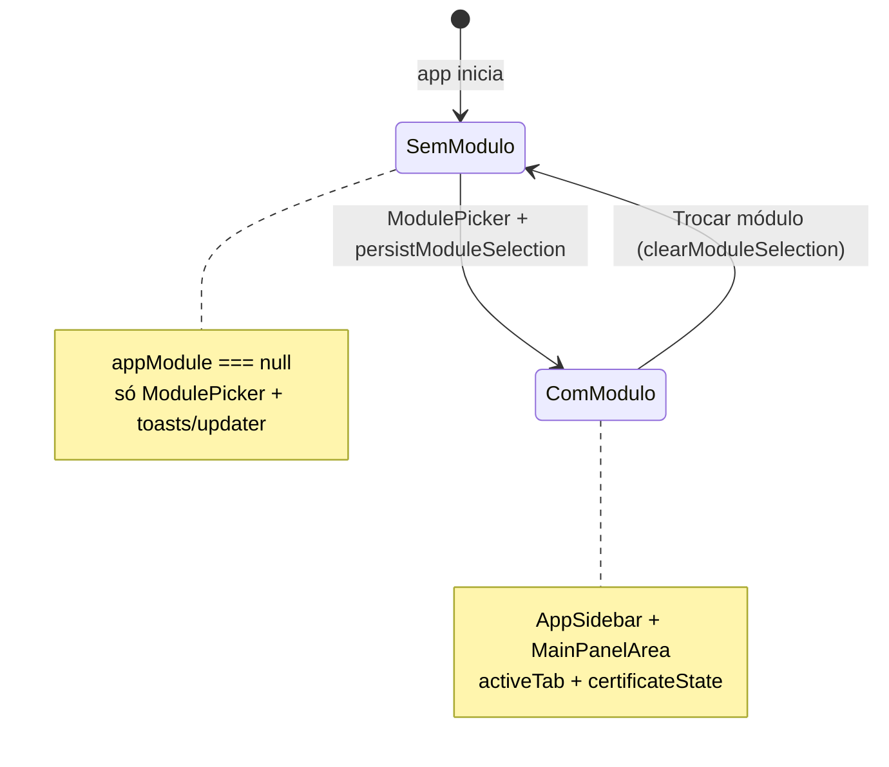
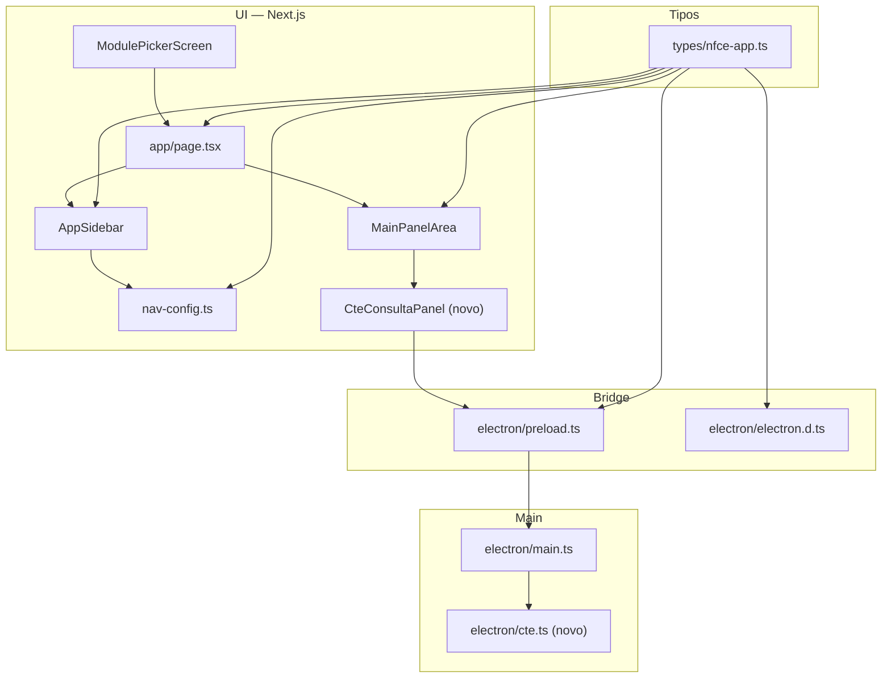
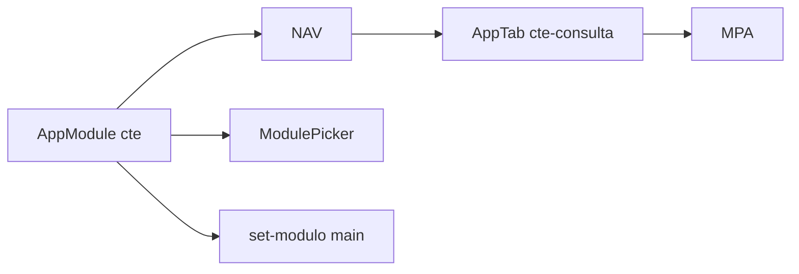

# Esquema de integração — módulo CT-e (eFis)

**Estado:** implementado no código — consulta **situação por chave** (`consSitCTe` → `retConsSitCTe`) via `CTeConsultaV4.asmx` (SP), IPC `cte:consulta-situacao`, painel **Consulta XML** no módulo **CT-e**.

Este documento descreve **onde e como** o módulo CT-e se conecta ao aplicativo existente. A especificação funcional e URLs estão em **`docs/MODULO-CTE-SEFAZ-SP.md`**.

---

## 1. Fluxo de sessão e estado global

- **`appModule`** vem de `useElectronAppMeta` → `window.electron.app.setModulo(modulo)`.
- No **main**, `app:set-modulo` **só valida** o literal e devolve `true`/`false`; **não grava** módulo no `electron-store` (há `limparModuloPersistidoDoStore()` no boot para remover legado).
- Ao escolher módulo em `app/page.tsx`, `escolherModulo` define `activeTab`: hoje `relatorio` → `relatorio`, `xml-retencao` → `xml-retencao`, senão → **`config`**. Para **CT-e**, o padrão natural é o mesmo de **NF-e / NFC-e**: abrir em **`config`** (certificado) e depois o usuário navega para a aba de consulta.

---

## 2. Camadas da integração

---

## 3. Checklist por arquivo (ordem sugerida)

| # | Arquivo | O que alterar |
|---|---------|----------------|
| 1 | `types/nfce-app.ts` | Incluir `'cte'` em `AppModule`. Incluir aba, ex.: `'cte-consulta'` (e futuras `'cte-dist-dfe'`, etc.) em `AppTab`. |
| 2 | `electron/main.ts` | No tipo `AppModule` (topo do ficheiro), incluir `'cte'`. No handler `app:set-modulo`, acrescentar `modulo === 'cte'` à condição **OR**. Registrar `ipcMain.handle('cte:…', …)` e delegar a `electron/cte.ts` + mesmo padrão de **agente HTTPS** / certificado que `sefaz` / `nfe` (reutilizar helpers já usados nos handlers existentes). |
| 3 | `electron/preload.ts` | Objeto `cte: { consultarPorChave: … }` com `ipcRenderer.invoke`. Estender `app.setModulo` com literal `'cte'`. |
| 4 | `electron/electron.d.ts` | `AppModule` + tipagem de `window.electron.cte`. |
| 5 | `components/nfce/shell/nav-config.ts` | Constante `CTE_NAV_TABS` (ex.: Certificado + Consulta XML). Em `navTabsForModule`, ramo `modulo === 'cte'`. |
| 6 | `components/nfce/shell/module-picker-screen.tsx` | Novo cartão “CT-e” com `onSelectModule('cte')`. Ajustar grelha (`md:grid-cols-5` ou duas linhas) para não espremer em ecrãs pequenos. |
| 7 | `app/page.tsx` | Em `escolherModulo`, se `modulo === 'cte'`, manter `setActiveTab('config')` (igual NF-e/NFC-e). |
| 8 | `components/nfce/shell/main-panel-area.tsx` | Importar painel CT-e. Condição: `activeTab === 'cte-consulta' && appModule === 'cte'` → renderizar painel com `certificateState`, `showToast`, `onLoadingStateChange`. |
| 9 | `components/nfce/shell/app-sidebar.tsx` | Textos condicionais do subtítulo e rodapé (`'CT-e'`, label tipo “SAE-CT-e” ou “CT-e SEFAZ-SP”) para `appModule === 'cte'`. Regra `appModule !== 'relatorio'` para certificado: **CT-e precisa de certificado** — tratar como `nfe`/`nfce` (mostrar bloco de certificado). |
| 10 | `electron/cte.ts` (+ parser opcional) | Novo ficheiro; sem alterar `sefaz.ts` / `nfe.ts` além do necessário. |

**Opcional documentação:** `docs/CONTEXTO-SISTEMA.md` — uma linha apontando para CT-e quando existir implementação.

---

## 4. Certificado e IPC

- **Mesmo estado** que NF-e/NFC-e: `CertificateUiState` + `ConfigPanel` já cobrem store / `.pfx`.
- O painel CT-e deve seguir o mesmo **gate** que outros painéis com SOAP: não chamar IPC sem `certificateReady` (ou mostrar aviso consistente com `CertificatePasswordWarning` onde fizer sentido).
- **Salvar XML:** reutilizar `window.electron.fs.salvarXml` / `selecionarPasta` como nos outros painéis, sem novo canal se não for preciso.

---

## 5. Overlay e “app ocupada”

- Para consulta **única por chave**, costuma ser rápido; ainda assim pode usar `onLoadingStateChange({ type: 'request' })` alinhado a `LoadingOverlay` em `page.tsx`, como outros fluxos curtos.
- Se no futuro existir **sync NSU** (AN), aí sim espelhar `nfe:sync-dist-progress` com canal `cte:sync-dist-progress` e `app:set-busy(true)` durante lotes.

---

## 6. Dependências entre peças

Sem `AppModule === 'cte'` e abas em `nav-config`, o utilizador nunca chega ao painel. Sem alargar `app:set-modulo` no **main**, `persistModuleSelection('cte')` falha silenciosamente (toast já existente em `page.tsx`).

---

## 7. Referência cruzada

| Documento | Conteúdo |
|-----------|-----------|
| `docs/MODULO-CTE-SEFAZ-SP.md` | URLs, SOAP, escopo SP vs AN, ordem de implementação técnica |
| `docs/CONTEXTO-SISTEMA.md` | Visão geral do eFis e IPC existente |

---

*Esquema de integração à estrutura atual do repositório; linhas de código citadas podem mudar — validar com grep nos símbolos `AppModule`, `app:set-modulo`, `navTabsForModule`.*
