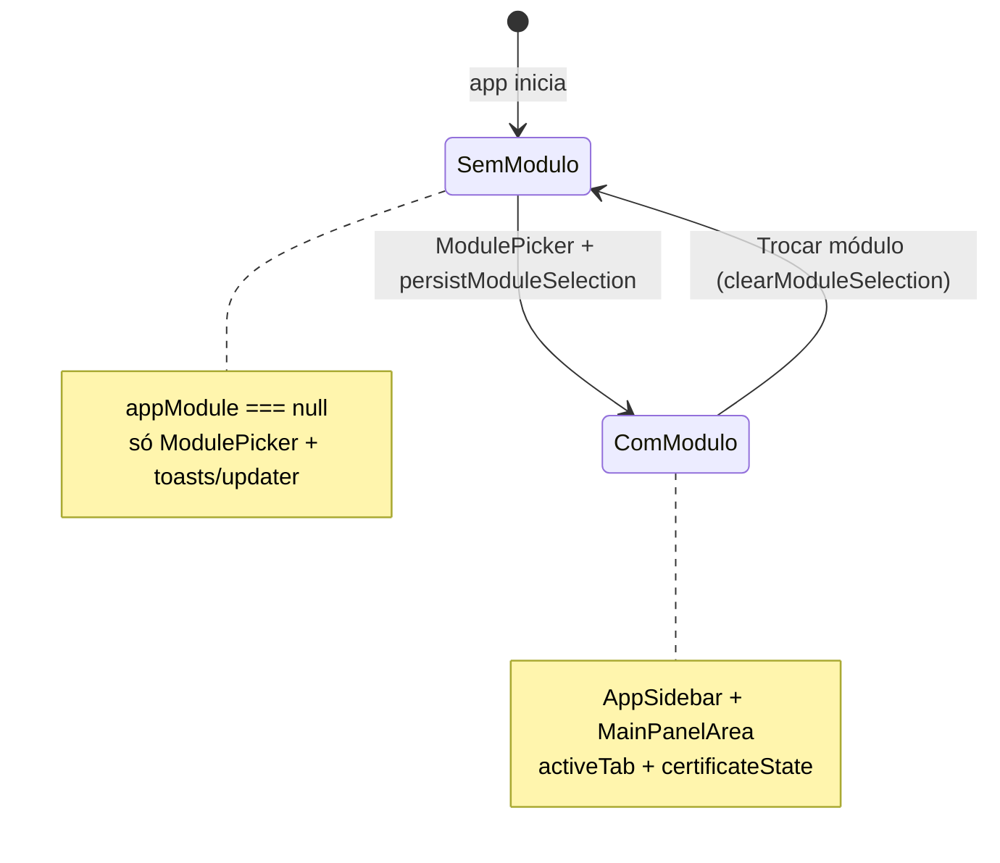
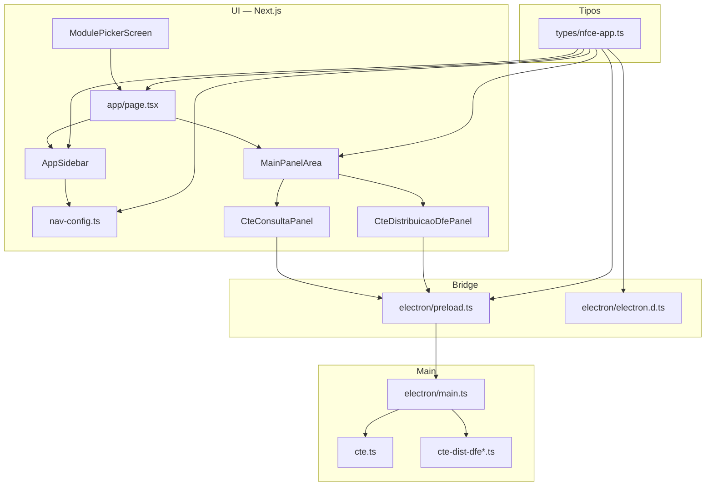
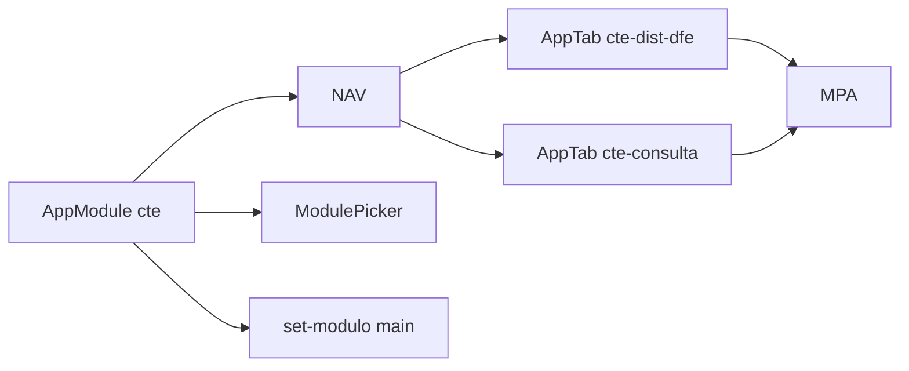

# Esquema de integração — módulo CT-e (eFis)

**Estado:** implementado — **consulta por chave** na SEFAZ-SP (`CTeConsultaV4`, `consSitCTe`) e **Distribuição DFe por NSU** na AN (`CTeDistribuicaoDFe`, `cteDistDFeInteresse`), com painéis **Consulta XML** e **Distribuição DFe**, IPC `cte:*` e progresso `cte:sync-dist-progress`.

Este documento descreve **onde e como** o módulo CT-e se liga ao eFis. A especificação funcional e URLs estão em **`docs/MODULO-CTE-SEFAZ-SP.md`**; o mapa sistémico em **`docs/ARQUITETURA-MODULO-CTE.md`**.

---

## 1. Fluxo de sessão e estado global

- **`appModule`** vem de `useElectronAppMeta` → `window.electron.app.setModulo(modulo)`.
- No **main**, `app:set-modulo` **só valida** o literal e devolve `true`/`false`; **não grava** módulo no `electron-store` (há `limparModuloPersistidoDoStore()` no boot para remover legado).
- Ao escolher módulo em `app/page.tsx`, `escolherModulo` define `activeTab`: hoje `relatorio` → `relatorio`, `xml-retencao` → `xml-retencao`, senão → **`config`**. Para **CT-e**, o padrão natural é o mesmo de **NF-e / NFC-e**: abrir em **`config`** (certificado) e depois o usuário navega para a aba de consulta.

---

## 2. Camadas da integração

---

## 3. Mapa de ficheiros (implementado)

| Área | Ficheiros |
|------|-----------|
| Tipos e abas | `types/nfce-app.ts` (`AppModule` `cte`, `AppTab` `cte-consulta`, `cte-dist-dfe`), `nav-config.ts` (`CTE_NAV_TABS`), `main-panel-area.tsx` |
| UI | `cte-consulta-panel.tsx`, `cte-distribuicao-dfe-panel.tsx`, `certificate-password-warning.tsx` (contexto `cte-dist`), `module-picker-screen.tsx` |
| Main / IPC | `electron/main.ts` (`app:set-modulo` inclui `cte`, handlers `cte:*`) |
| Bridge | `electron/preload.ts`, `electron/electron.d.ts` (`window.electron.cte.*`) |
| Lógica SP | `electron/cte.ts`, `electron/cte-consulta-parser.ts` |
| Lógica AN DistDFe | `electron/cte-dist-dfe.ts`, `cte-dist-dfe-build.ts`, `cte-dist-dfe-parser.ts`, `cte-dist-dfe-sync.ts`, `cte-list-xmls-local.ts` |
| Arranque módulo | `app/page.tsx` — ao escolher CT-e, `activeTab` inicial em `config` (certificado), como NF-e/NFC-e |

---

## 4. Certificado e IPC

- **Mesmo estado** que NF-e/NFC-e: `CertificateUiState` + `ConfigPanel` já cobrem store / `.pfx`.
- O painel CT-e deve seguir o mesmo **gate** que outros painéis com SOAP: não chamar IPC sem `certificateReady` (ou mostrar aviso consistente com `CertificatePasswordWarning` onde fizer sentido).
- **Salvar XML:** reutilizar `window.electron.fs.salvarXml` / `selecionarPasta` como nos outros painéis, sem novo canal se não for preciso.

---

## 5. Overlay e “app ocupada”

- Consulta **única por chave** costuma ser rápida; usa `onLoadingStateChange` como outros fluxos curtos.
- **Sync DistDFe (AN):** `cte:sync-dist-progress` no main e `window.electron.cte.onSyncDistProgress` no renderer; `app:set-busy(true)` durante a sincronização (vários lotes).

---

## 6. Dependências entre peças

Sem `AppModule === 'cte'` e abas em `nav-config`, o utilizador nunca chega ao painel. Sem alargar `app:set-modulo` no **main**, `persistModuleSelection('cte')` falha silenciosamente (toast já existente em `page.tsx`).

---

## 7. Referência cruzada

| Documento | Conteúdo |
|-----------|----------|
| `docs/ARQUITETURA-MODULO-CTE.md` | Camadas, dois eixos (SP vs AN), IPC, estado em disco |
| `docs/MODULO-CTE-SEFAZ-SP.md` | URLs, SOAP, escopo SP vs AN |
| `docs/CONTEXTO-SISTEMA.md` | Visão geral do eFis e IPC existente |

---

*Integração alinhada ao repositório atual; validar com grep em `AppModule`, `app:set-modulo`, `navTabsForModule`, `cte:sync-dist`.*
