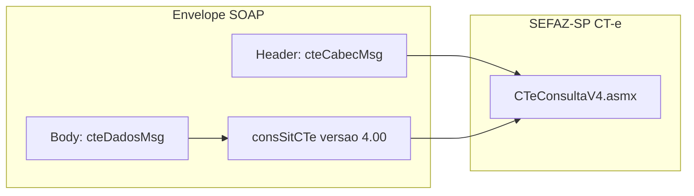
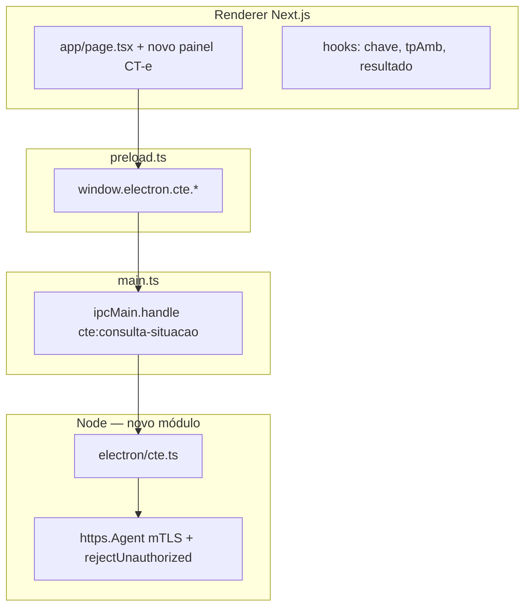

# Módulo proposto: consulta XML CT-e — SEFAZ-SP (e API nacional relacionada)

Documento de **especificação e esquema** (não implementação). Objetivo: integrar ao **eFis** (Electron + Next.js) o fluxo de **consulta de situação / XML de CT-e**, reutilizando o mesmo modelo de **certificado mTLS**, **IPC** e **parser XML** já usados em NFC-e e NF-e.

---

## 1. Escopo em duas camadas

| Camada | O quê | Onde | Observação |
|--------|--------|------|------------|
| **A — Consulta por chave (SP)** | `CTeConsultaV4` com `consSitCTe` | Web Service estadual SEFAZ-SP | Retorno típico inclui situação e, quando autorizado, **protocolo com XML** (`protCTe`). É o foco natural do nome “consulta XML CT-e SEFAZ SP”. |
| **B — Distribuição em lote (NSU)** | `CTeDistribuicaoDFe` | **Ambiente nacional** (AN), não exclusivo de SP | Mesmo padrão conceitual da NF-e `NFeDistribuicaoDFe`: fila por NSU, lotes de até 50 documentos, vários papéis no CT-e. Pode ser **segunda fase** do módulo ou módulo “CT-e AN” separado na UI. |

**Fora do escopo oficial do app:** APIs REST de terceiros (Webmania, TecnoSpeed, etc.); o eFis hoje integra **SOAP + certificado do usuário**.

---

## 2. URLs oficiais (CT-e v4.00 — referência)

### Produção (SEFAZ-SP)

| Serviço | URL |
|---------|-----|
| Consulta CT-e | `https://nfe.fazenda.sp.gov.br/CTeWS/WS/CTeConsultaV4.asmx` |
| Recepção de eventos | `https://nfe.fazenda.sp.gov.br/CTeWS/WS/CTeRecepcaoEventoV4.asmx` |
| Recepção síncrona | `https://nfe.fazenda.sp.gov.br/CTeWS/WS/CTeRecepcaoSincV4.asmx` |
| Status do serviço | `https://nfe.fazenda.sp.gov.br/CTeWS/WS/CTeStatusServicoV4.asmx` |

### Homologação (SP)

| Serviço | URL |
|---------|-----|
| Consulta CT-e | `https://homologacao.nfe.fazenda.sp.gov.br/CTeWS/WS/CTeConsultaV4.asmx` |
| Recepção síncrona | `https://homologacao.nfe.fazenda.sp.gov.br/CTeWS/WS/CTeRecepcaoSincV4.asmx` |
| Status do serviço | `https://homologacao.nfe.fazenda.sp.gov.br/CTeWS/WS/CTeStatusServicoV4.asmx` |

**Regra de produto:** alinhar ao restante do eFis (hoje **produção** fixa em vários fluxos) ou expor **tpAmb** / seletor homologação apenas no módulo CT-e, conforme decisão de produto.

---

## 3. Diferença de envelope SOAP em relação ao NFC-e / NF-e

No projeto atual:

- **NFC-e SP:** `soap12:Envelope` + `nfeDadosMsg` com `application/soap+xml` e `action=...` (SOAP 1.2).
- **NF-e AN:** padrão semelhante com `nfeDadosMsg` / `nfeDistDFeInteresse` e **SOAP 1.2**.

O **CT-e Consulta v4** da documentação oficial costuma usar **cabeçalho** `cteCabecMsg` (`cUF`, `versaoDados`) e **corpo** `cteDadosMsg` com o XML `consSitCTe` dentro do namespace do schema CT-e — **não** é um “copiar e colar” do `nfeDadosMsg`.

**Implementação:** gerar envelope conforme **WSDL/XSD oficiais** do Portal Fiscal (`CTeConsulta4`), e validar **Content-Type** e **SOAPAction** / **action** no `Content-Type` exatamente como o serviço exige (pode ser SOAP 1.2 como na NF-e; o exemplo informal com `text/xml` e `SOAPAction: ""` deve ser **substituído** pelo contrato real após leitura do WSDL no ambiente de homologação).

---

## 4. XML de negócio — consulta por chave (`consSitCTe`)

Elementos conceituais (ajustar ordem/atributos ao XSD 4.00):

- `versao`: `4.00`
- `tpAmb`: `1` produção / `2` homologação
- `xServ`: `CONSULTAR` (conforme manual)
- `chCTe`: chave de **44 dígitos**

Resposta esperada (camadas de parsing):

- `cStat`, `xMotivo`
- `chCTe`
- `protCTe` (quando aplicável) — contém o **XML autorizado** / protocolo para extração e gravação em disco

Tratamento de erros: espelhar **NF-e** / **NFC-e** — exibir `xMotivo`, mapear `cStat` frequentes, retry em `ECONNRESET` / `ETIMEDOUT` se já existir política global no `main`.

---

## 5. Arquitetura no eFis (alinhamento ao código existente)

Arquivos sugeridos (MVP camada A):

| Arquivo | Responsabilidade |
|---------|------------------|
| `electron/cte.ts` | Constantes de URL (prod/hom), montagem do envelope SOAP, `postSoap`, chamada `cteConsultaCT` (nome da operação conforme WSDL). |
| `electron/cte-consulta-parser.ts` | `fast-xml-parser` — extrair `retConsSitCTe`, `cStat`, `protCTe`, XML interno. |
| `electron/main.ts` | Handlers IPC, reutilizar criação de agente HTTPS a partir do mesmo fluxo de certificado que `sefaz` / `nfe`. |
| `electron/preload.ts` + `electron/electron.d.ts` | Expor `electron.cte.consultarPorChave(...)`. |
| `components/nfce/panels/cte-consulta-panel.tsx` | UI: campo chave, ambiente, botão consultar, área de status + botão salvar XML. |
| `types/nfce-app.ts` (ou `types/cte-app.ts`) | `AppModule` incluir `cte`; `AppTab` incluir ex. `cte-consulta`. |
| `components/nfce/shell/nav-config.ts` | Abas do módulo CT-e. |
| `hooks/use-electron-app-meta.ts` | Persistir módulo `cte` se desejado (espelho do padrão `nfce` / `nfe`). |

**Fase 2 (camada B):** novo cliente `electron/cte-dist-dfe.ts` + parser de `retDistDFeInt` espelhando `nfe-dist-dfe-*`, endpoint AN de `CTeDistribuicaoDFe`, estado `.cte-dist-state.json` (ou pasta unificada por decisão de produto).

---

## 6. Superfície IPC proposta (MVP)

| Canal | Payload (conceitual) | Retorno |
|-------|----------------------|---------|
| `cte:consulta-situacao` | `ConfigCert` + `chCTe` + `tpAmb` + `ambienteEndpoint` `producao` \| `homologacao` | `{ ok, cStat, xMotivo, xmlProtCte?: string, soapBruto?: string }` ou erro de rede |

Opcionais posteriores:

- `cte:status-servico` — health / mensagem institucional
- `cte:recepcao-evento` — espelho de `nfeRecepcaoEventoNF` com envelope CT-e
- `cte:sync-dist-dfe` — fila NSU (fase 2)

---

## 7. UX proposta

1. **Sidebar:** novo módulo **“CT-e”** (ícone caminhão / documento).
2. **Aba Certificado:** reutilizar o mesmo estado global de certificado (ou exigir revalidação).
3. **Aba Consulta XML:** entrada da chave (44 dígitos), seleção produção/homologação, resultado com `cStat` / `xMotivo`, preview do trecho XML, ações **Salvar XML** e **Abrir pasta** (reutilizar `electron.fs` existente).
4. **Confirmação ao fechar:** já existe `app:set-busy` para operações longas; consulta por chave costuma ser rápida, mas manter padrão se houver sync NSU no futuro.

---

## 8. Pontos de atenção (requisitos e riscos)

- **Certificado:** e-CNPJ ICP-Brasil; o CNPJ do certificado deve ser **compatível** com o papel na consulta (emitente/tomador/etc., conforme regra da SEFAZ para aquele documento).
- **Autorizador / SVSP / SVC:** documentação operacional (contingência, UF autorizadora) afeta **emissão** e roteamento; a **consulta na URL SP** acima segue o contrato publicado pela SEFAZ-SP para o serviço instalado nesse host — validar no MOC se a chave consultada deve ir sempre a SP ou se há redirecionamento por UF (depende da chave `cUF` na própria chave de acesso).
- **Parse:** usar `fast-xml-parser` com as mesmas cautelas da NF-e (`removeNSPrefix`, evitar notação científica em campos numéricos longos se houver IDs em nós).
- **Segurança:** igual ao restante — sem expor PFX ao renderer; senha só no main; `rejectUnauthorized` alinhado à política atual do projeto.

---

## 9. Ordem sugerida de implementação

1. Baixar WSDL `CTeConsultaV4` (homologação), fixar envelope e **um** caso de teste com chave válida.
2. Implementar `electron/cte.ts` + parser + IPC + painel mínimo.
3. Testes manuais prod/hom conforme política do produto.
4. Documentar `cStat` usuais de `retConsSitCTe` em apêndice (tabela no `CONTEXTO.md` ou neste arquivo).
5. (Opcional) `CTeDistribuicaoDFe` na AN em módulo ou sub-aba “Distribuição DFe CT-e”.

---

## 10. Referências cruzadas no repositório

- **Integração na UI e tipos (checklist por ficheiro):** `docs/INTEGRACAO-MODULO-CTE.md`.
- Padrão SOAP 1.2 + `application/soap+xml`: `electron/nfe.ts`, `electron/sefaz.ts`.
- IPC e bridge: `electron/preload.ts`, `electron/main.ts`.
- Contexto geral: `docs/CONTEXTO-SISTEMA.md`, `CONTEXTO.md`.

---

*Documento esquemático para planejamento; ajustar nomes de operações e namespaces após fixação do WSDL oficial na versão alvo.*
