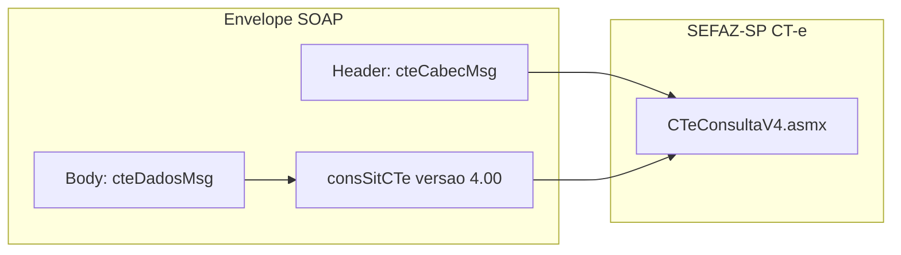
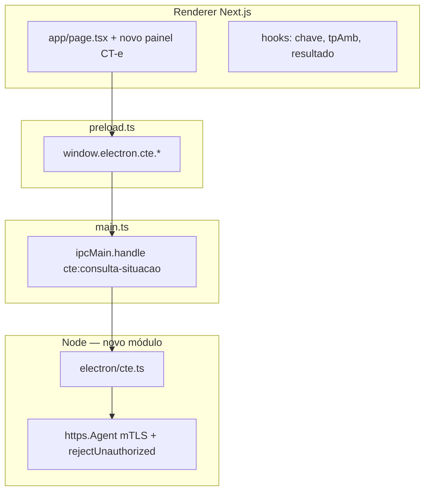

# Módulo CT-e — SEFAZ-SP e Ambiente Nacional (referência técnica)

Documento de **especificação e referência** alinhado ao **eFis** (Electron + Next.js): **consulta por chave** na SEFAZ-SP e **distribuição DFe por NSU** na AN. A arquitetura ficheiro-a-ficheiro está em **`docs/ARQUITETURA-MODULO-CTE.md`**.

---

## 1. Escopo em duas camadas

| Camada | O quê | Onde | Observação |
|--------|--------|------|------------|
| **A — Consulta por chave (SP)** | `CTeConsultaV4` com `consSitCTe` | Web Service estadual SEFAZ-SP | Retorno típico inclui situação e, quando autorizado, **protocolo com XML** (`protCTe`). É o foco natural do nome “consulta XML CT-e SEFAZ SP”. |
| **B — Distribuição em lote (NSU)** | `CTeDistribuicaoDFe` / `cteDistDFeInteresse` | **Ambiente nacional** (AN) | **Implementado** no eFis: URL `https://www1.cte.fazenda.gov.br/CTeDistribuicaoDFe/CTeDistribuicaoDFe.asmx`, aba **Distribuição DFe**, estado `.cte-dist-state.json`, filtros emitente/destinatário. |

**Fora do escopo oficial do app:** APIs REST de terceiros (Webmania, TecnoSpeed, etc.); o eFis hoje integra **SOAP + certificado do usuário**.

---

## 2. URLs oficiais (CT-e v4.00 — referência)

### Produção (SEFAZ-SP)

| Serviço | URL |
|---------|-----|
| Consulta CT-e | `https://nfe.fazenda.sp.gov.br/CTeWS/WS/CTeConsultaV4.asmx` |
| Recepção de eventos | `https://nfe.fazenda.sp.gov.br/CTeWS/WS/CTeRecepcaoEventoV4.asmx` |
| Recepção síncrona | `https://nfe.fazenda.sp.gov.br/CTeWS/WS/CTeRecepcaoSincV4.asmx` |
| Status do serviço | `https://nfe.fazenda.sp.gov.br/CTeWS/WS/CTeStatusServicoV4.asmx` |

### Homologação (SP)

| Serviço | URL |
|---------|-----|
| Consulta CT-e | `https://homologacao.nfe.fazenda.sp.gov.br/CTeWS/WS/CTeConsultaV4.asmx` |
| Recepção síncrona | `https://homologacao.nfe.fazenda.sp.gov.br/CTeWS/WS/CTeRecepcaoSincV4.asmx` |
| Status do serviço | `https://homologacao.nfe.fazenda.sp.gov.br/CTeWS/WS/CTeStatusServicoV4.asmx` |

**Regra de produto:** alinhar ao restante do eFis (hoje **produção** fixa em vários fluxos) ou expor **tpAmb** / seletor homologação apenas no módulo CT-e, conforme decisão de produto.

---

## 3. Diferença de envelope SOAP em relação ao NFC-e / NF-e

No projeto atual:

- **NFC-e SP:** `soap12:Envelope` + `nfeDadosMsg` com `application/soap+xml` e `action=...` (SOAP 1.2).
- **NF-e AN:** padrão semelhante com `nfeDadosMsg` / `nfeDistDFeInteresse` e **SOAP 1.2**.

O **CT-e Consulta v4** da documentação oficial costuma usar **cabeçalho** `cteCabecMsg` (`cUF`, `versaoDados`) e **corpo** `cteDadosMsg` com o XML `consSitCTe` dentro do namespace do schema CT-e — **não** é um “copiar e colar” do `nfeDadosMsg`.

**Implementação:** gerar envelope conforme **WSDL/XSD oficiais** do Portal Fiscal (`CTeConsulta4`), e validar **Content-Type** e **SOAPAction** / **action** no `Content-Type` exatamente como o serviço exige (pode ser SOAP 1.2 como na NF-e; o exemplo informal com `text/xml` e `SOAPAction: ""` deve ser **substituído** pelo contrato real após leitura do WSDL no ambiente de homologação).

---

## 4. XML de negócio — consulta por chave (`consSitCTe`)

Elementos conceituais (ajustar ordem/atributos ao XSD 4.00):

- `versao`: `4.00`
- `tpAmb`: `1` produção / `2` homologação
- `xServ`: `CONSULTAR` (conforme manual)
- `chCTe`: chave de **44 dígitos**

Resposta esperada (camadas de parsing):

- `cStat`, `xMotivo`
- `chCTe`
- `protCTe` (quando aplicável) — contém o **XML autorizado** / protocolo para extração e gravação em disco

Tratamento de erros: espelhar **NF-e** / **NFC-e** — exibir `xMotivo`, mapear `cStat` frequentes, retry em `ECONNRESET` / `ETIMEDOUT` se já existir política global no `main`.

---

## 5. Arquitetura no eFis (alinhamento ao código existente)

Ficheiros **em produção** no repositório:

| Ficheiro | Responsabilidade |
|---------|------------------|
| `electron/cte.ts` | Consulta SP: URLs prod/hom, envelope `cteCabecMsg` + `cteDadosMsg`, `cteConsultaCT`, retry |
| `electron/cte-consulta-parser.ts` | `retConsSitCTe`, resumo e XMLs úteis |
| `electron/cte-dist-dfe-build.ts` | `distDFeInt` namespace CT-e, listagem NSU |
| `electron/cte-dist-dfe.ts` | SOAP `cteDistDFeInteresse` (AN produção) |
| `electron/cte-dist-dfe-parser.ts` | `retDistDFeInt`, docZip, chaves, filtros papel |
| `electron/cte-dist-dfe-sync.ts` | Sincronização NSU, progresso com `documentosLote` |
| `electron/cte-list-xmls-local.ts` | Listar XMLs gravados na árvore CT-e |
| `electron/main.ts` | IPC `cte:*` |
| `electron/preload.ts` + `electron/electron.d.ts` | `window.electron.cte` |
| `components/nfce/panels/cte-consulta-panel.tsx` | Aba consulta por chave |
| `components/nfce/panels/cte-distribuicao-dfe-panel.tsx` | Aba DistDFe AN |
| `types/nfce-app.ts`, `nav-config.ts`, `main-panel-area.tsx`, `module-picker-screen.tsx` | Módulo e abas |

---

## 6. Superfície IPC (implementada)

| Canal | Função |
|-------|--------|
| `cte:consulta-situacao` | Consulta SP por chave (`consSitCTe`) |
| `cte:distribuicao-dfe` | SOAP AN com XML livre em `cteDadosMsg` |
| `cte:dist-dfe-estado` | Lê `ultNSU` persistido (`.cte-dist-state.json`) |
| `cte:sync-dist-dfe` | Sincronização contínua por NSU |
| `cte:listar-xmls-salvos` | Lista XMLs na pasta raiz / CNPJ |
| `cte:sync-dist-progress` | Evento main → renderer (lotes, `documentosLote`, conclusão, erro) |

**Opcional futuro:** `cte:status-servico`, `cte:recepcao-evento` (espelho NF-e), consulta por chave na AN (`consChCTe`) se integrado.

---

## 7. UX (implementada)

1. **Módulo CT-e** no ecrã inicial; **sidebar** com abas **Certificado**, **Distribuição DFe**, **Consulta XML**.
2. **Distribuição DFe:** pasta raiz, CNPJ, `cUFAutor`, filtro (todos / emitente / destinatário), sincronização, tabela de documentos da sessão, listagem de ficheiros gravados, modo XML avançado.
3. **Consulta XML:** chave, `tpAmb`, endpoint SP prod/hom, guardar `procCTe` / `protCTe` / SOAP.
4. **`app:set-busy`** durante operações; DistDFe pode ser longa (vários lotes).

---

## 8. Pontos de atenção (requisitos e riscos)

- **Certificado:** e-CNPJ ICP-Brasil; o CNPJ do certificado deve ser **compatível** com o papel na consulta (emitente/tomador/etc., conforme regra da SEFAZ para aquele documento).
- **Autorizador / SVSP / SVC:** documentação operacional (contingência, UF autorizadora) afeta **emissão** e roteamento; a **consulta na URL SP** acima segue o contrato publicado pela SEFAZ-SP para o serviço instalado nesse host — validar no MOC se a chave consultada deve ir sempre a SP ou se há redirecionamento por UF (depende da chave `cUF` na própria chave de acesso).
- **Parse:** usar `fast-xml-parser` com as mesmas cautelas da NF-e (`removeNSPrefix`, evitar notação científica em campos numéricos longos se houver IDs em nós).
- **Segurança:** igual ao restante — sem expor PFX ao renderer; senha só no main; `rejectUnauthorized` alinhado à política atual do projeto.

---

## 9. Manutenção e evolução

1. Manter envelope e operações alinhados ao WSDL `CTeConsultaV4` / `CTeDistribuicaoDFe` da versão em uso.
2. Regressão manual: consulta SP (prod/hom) e ciclo DistDFe (138/137, filtros emitente/destinatário).
3. Documentar `cStat` usuais de `retConsSitCTe` e `retDistDFeInt` em apêndice (`CONTEXTO.md` ou este ficheiro) conforme forem surgindo casos de suporte.
4. **Extensões possíveis (não implementadas):** `consChCTe` na AN, recepção de evento CT-e, DACTe/PDF local — ver notas em `ARQUITETURA-MODULO-CTE.md`.

---

## 10. Referências cruzadas no repositório

- **Arquitetura sistémica do módulo:** `docs/ARQUITETURA-MODULO-CTE.md`.
- **Integração na UI e tipos (checklist):** `docs/INTEGRACAO-MODULO-CTE.md`.
- Padrão SOAP 1.2 + `application/soap+xml`: `electron/nfe.ts`, `electron/sefaz.ts`.
- IPC e bridge: `electron/preload.ts`, `electron/main.ts`.
- Contexto geral: `docs/CONTEXTO-SISTEMA.md`, `CONTEXTO.md`.

---

*Referência técnica alinhada ao código; validar operações e namespaces com o WSDL oficial da versão em uso na SEFAZ.*
